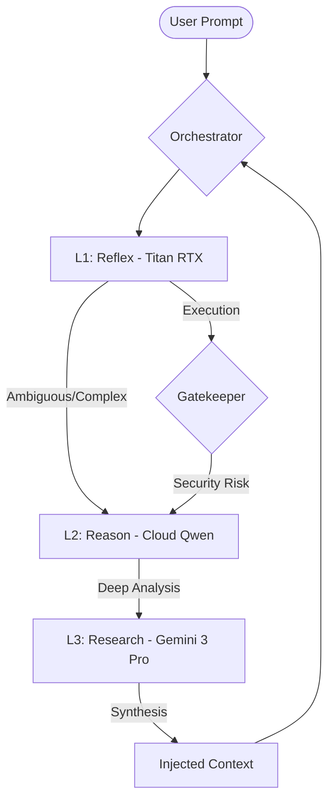
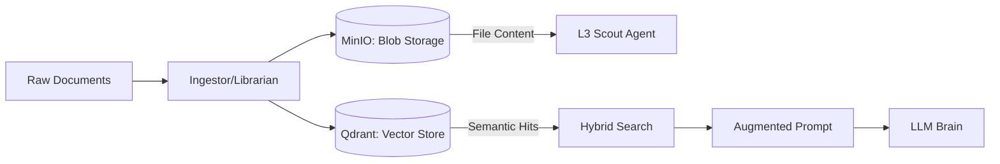

# Gravitas Grounded Research
## The Authoritative Manual for v4.0 Architecture

### 1. THE PHILOSOPHY: Grounded Research
**Gravitas Grounded Research** is a high-performance, agentic RAG platform designed for "zero-hallucination" engineering and deep document synthesis. Unlike traditional AI assistants, Gravitas is **Grounded**: every response is backed by a verifiable research trail in the vector store and object storage.

*   **Omni-RAG:** A unified memory system that integrates local codebases, remote documentation, and unstructured data dumps.
*   **Governance:** A strict 3-layer cognitive heirarchy ensures that every action is reviewed and approved by increasingly sophisticated models.
*   **TDD First:** The system is built on Test-Driven Development. No feature moves to production without a passing test suite and a "Receipt" (`completed.md`).

---

### 2. ARCHITECTURE (v4.0)

#### 2.1 The 3-Layer Brain
The system maximizes "Inference Economy" by routing tasks through three specialized layers.

#### 2.2 Dual-GPU Split
To prevent resource contention, the system segments workloads across dedicated hardware.

*   **Titan RTX (24GB VRAM):** The **Brain Engine**. Dedicated to LLM inference (L1) and local generation.
*   **GTX 1060 (6GB VRAM):** The **Memory Engine**. Dedicated to embedding generation (Dense/Sparse) and UI rendering/OS tasks.

#### 2.3 Memory Flow (Hybrid Storage)
Gravitas uses a dual-backend approach to manage data persistence and retrieval.

---

### 3. THE NEXUS MANUAL (User Guide)

#### 3.1 Mode Switching
The system operates in two primary modes:
*   **RAG Mode:** Focuses on information retrieval and answering questions from the documents.
*   **DEV Mode:** Optimized for code generation, refactoring, and tool execution.

#### 3.2 The Librarian (Night Shift)
The **Librarian Agent** handles the background task of data curation. 
- **Trigger:** Click "START NIGHT SHIFT" in the Nexus Dashboard.
- **Workflow:** Scans `./data/inbox`, summarizes content, uploads to MinIO, and indexes to Qdrant.

#### 3.3 The Scout (Deep Research)
The **Scout Agent** is deployed for long-horizon analysis.
- **Goal:** Synthesize information from multiple sources.
- **Usage:** Triggered via the Deep Research panel in Nexus for complex queries requiring L3 capabilities.

#### 3.4 The financial HUD
Found at the top of the Nexus dashboard, the HUD tracks:
- **Daily Spend:** Total cost from cloud models (L2/L3).
- **Inference Efficiency:** Ratio of local vs. cloud calls.
- **Quality Score:** Aggregated system performance metrics.

---

### 4. DEVELOPER PROTOCOLS

#### 4.1 The "Receipt" Rule
No task is considered complete until a `completed_phaseX.md` file is generated. This file must contain:
1.  A summary of changes.
2.  A list of manual verification steps performed.
3.  The output of the relevant test suite.

#### 4.2 The "Gatekeeper" Rule
All L1-proposed shell commands or file edits must pass through `app/safety.py`. If the Gatekeeper flags an action, it is automatically escalated to L2 for a "Reasoned Verdict". **Never bypass the Gatekeeper in production.**

#### 4.3 Running the Test Suite
The law of the land is TDD.
- **Run all tests:** `pytest tests/`
- **Specific component:** `pytest tests/test_memory_logic.py`
- **With coverage:** `pytest --cov=app tests/`

---

### 5. SYSTEM RECOVERY
If the brain enters a "Split Brain" state or services fail:
1.  Check Docker status: `docker-compose ps`
2.  Verify GPU mapping: `nvidia-smi`
3.  Restart services: `docker-compose restart`
