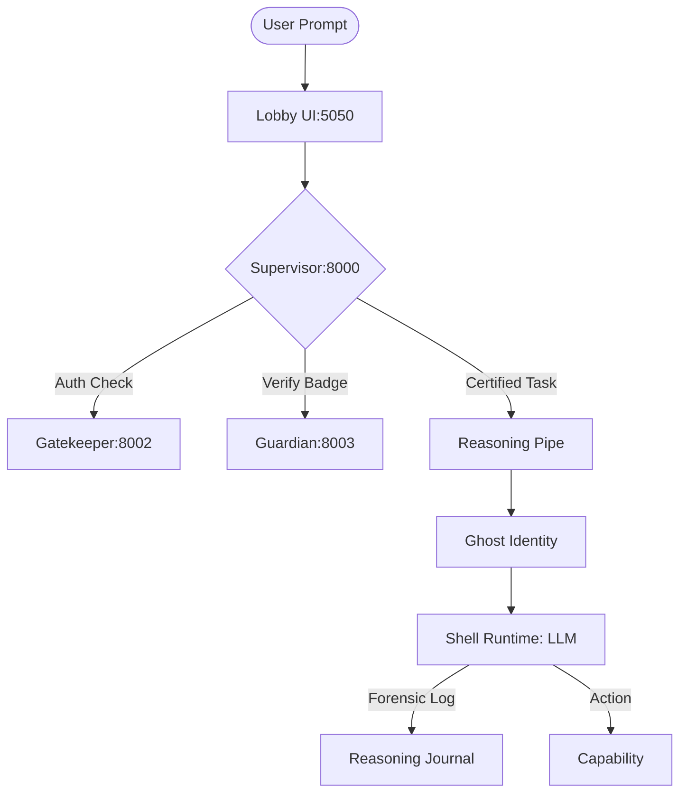

# 📖 [READ ME] GRAVITAS GROUNDED RESEARCH - MASTER MANUAL
## Authority Version: 7.0.0 (The Security Tier)

### 1. THE PHILOSOPHY: The Agentic Enterprise
**Gravitas Grounded Research** is a secure, multi-agent "Knowledge Factory" designed for **Zero-Hallucination** engineering. It operates on the **Ghost/Shell Meta-Model**, separating persistent identities from interchangeable model runtimes.

*   **Ghost Identity:** The permanent role (e.g., The Librarian, The Scout).
*   **Shell Runtime:** The ephemeral LLM powering it (e.g., Gemini 2.0 Flash, Claude 3.5 Sonnet).
*   **Reasoning Pipes:** A bit-for-bit forensic log of every "thought" an agent has, utilizing a standardized Markdown protocol for verifiable chain-of-thought.
*   **Governance:** A **Supervisor-Gatekeeper-Guardian** triad ensures that no agent executes an action without a valid certificate and policy approval.

---

### 2. THE MISSION CONTROL CENTER
Gravitas exposes specialized interfaces for different layers of operation.

#### 2.1 The Lobby (User Interface)
*   **URL:** `http://localhost:5050`
*   **Role:** The public face of the enterprise.
*   **Function:** Real-time chat, context management, and "Office" simulation.

#### 2.2 The Supervisor Service (Governance Gateway)
*   **Port:** `8000`
*   **Role:** The intelligent orchestrator.
*   **Function:** Routes requests, enforces architecture patterns, and manages the agent lifecycle.

#### 2.3 The Guardian (Certificate Authority)
*   **Port:** `8003`
*   **Role:** The internal affairs officer.
*   **Function:** Issues and validates cryptographic "Badges" (JWTs) for agents. No badge, no compute.

#### 2.4 The Gatekeeper (Policy Engine)
*   **Port:** `8001/8002`
*   **Role:** The security officer.
*   **Function:** Runtime enforcement of access control policies (e.g., "Scout cannot Delete files").

---

### 3. ARCHITECTURE (v7.0)

#### 3.1 The Enterprise Flow
Requests flow through a strictly governed pipeline:



#### 3.2 Dual-GPU Hardware Layer
*   **GPU 0 (Titan RTX - 24GB):** The **Brain Engine**. Dedicated to local generation (L1/L2 Models like Qwen/Llama).
*   **GPU 1 (GTX 1060 - 6GB):** The **Memory Engine**. Dedicated to embedding generation (Ollama-Embed) and vector operations.

#### 3.3 Memory Systems
*   **Qdrant:** High-speed vector storage for semantic retrieval.
*   **MinIO:** S3-compatible object storage for raw documents.
*   **Postgres:** Structured history and relational "Office" state (Ghosts, Shells, Artifacts).

---

### 4. DEVELOPER PROTOCOLS

#### 4.1 The "Dual-Track" Journaling Rule
*   **Strategic Journals (`docs/journals/`):** High-level architectural decisions and project direction.
*   **Reasoning Logs (`app/logs/reasoning/`):** detailed, automated logs of agent logic chains (The "Thinking Transparency" Logs).

#### 4.2 The "Certificate" Rule
New wrappers and agents must be **Certified** before deployment.
*   **Run Certification:** `pytest tests/integration/test_wrapper_certification.py`
*   **Verify Compliance:** `pytest tests/integration/test_reasoning_pipe_e2e.py`

#### 4.3 Standard Operations
*   **Run All Tests:** `pytest tests/`
*   **Unit Tests Only:** `pytest tests/unit/`
*   **Integration Tests:** `pytest tests/integration/` (Requires running Docker stack)

---

### 5. SYSTEM RECOVERY
If the enterprise stalls or "split-brain" occurs:

1.  **Check Hardware:** `nvidia-smi`
2.  **Restart Stack:**
    ```bash
    ./scripts/reset_gravitas.sh
    ```
    *(This script performs a safe teardown, prunes orphans, and restarts the Docker compose stack)*
3.  **View Logs:** `docker logs -f gravitas_supervisor` (or relevant container)
