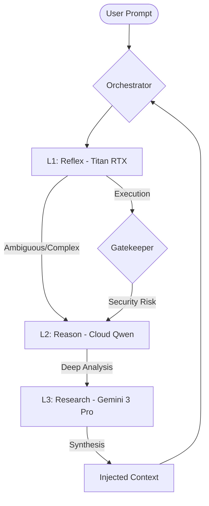
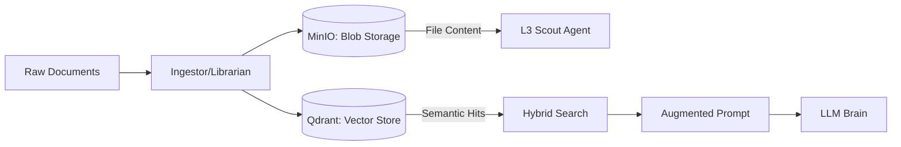

# 📖 [READ ME] GRAVITAS GROUNDED RESEARCH - MASTER MANUAL
## Authority Version: 4.2.0 (Grounded Execution)

### 1. THE PHILOSOPHY: Grounded Research
**Gravitas Grounded Research** is a high-performance, agentic RAG platform designed for "zero-hallucination" engineering and deep document synthesis. Unlike traditional AI assistants, Gravitas is **Grounded**: every response is backed by a verifiable research trail in the vector store and object storage.

*   **Omni-RAG:** A unified memory system that integrates local codebases, remote documentation, and unstructured data dumps.
*   **Governance:** A strict 3-layer cognitive hierarchy ensures that every action is reviewed and approved by increasingly sophisticated models.
*   **TDD First:** The system is built on Test-Driven Development. No feature moves to production without a passing test suite and a "Receipt" (`completed.md`).

---

### 2. THE MISSION CONTROL CENTER (Dashboards)
Gravitas provides three distinct interfaces for system visibility and control.

#### 2.1 The Nexus Dashboard (User Interface)
The primary Web UI found at `http://localhost:5050`. It is the "Face" of Gravitas.
*   **Interaction:** Real-time chat with LLM layers.
*   **Mode Switching:** Toggle between **RAG Mode** (Research) and **DEV Mode** (Refactoring/Automation).
*   **Financial HUD:** Live tracking of Daily Spend, local vs. cloud inference ratios, and Quality Scores.
*   **Agent Control:** Deploy the **Librarian** for data curation or the **Scout** for deep research (expanded roles in Phase 7: Web Search, Hyper-Scraping, and YouTube/Audio Transcription).

#### 2.2 The Monitor Dashboard (Hardware Metrics)
A real-time CLI dashboard triggered by `./scripts/monitor.sh`.
*   **VRAM Sensing:** Live usage stats for the Titan RTX (L1) and GTX 1060 (Embeddings).
*   **Container Health:** Instant status of all Gravitas microservices (Qdrant, MinIO, Postgres, etc.).
*   **Memory Pressure:** Visual indicators of VRAM lockouts or resource contention.

#### 2.3 The Master Control Dashboard (System Management - UPCOMING)
A high-authority UI (Phase 4) designed for deep systems administration.
*   **Service Orchestration:** GUI-based system resets and container restarts.
*   **Model Management:** One-click "pull" and activation for new local LLMs.
*   **Maintenance:** GUI controls for journal rotations and log purges.
*   **Network Probes:** Live testing of L2/L3 cloud connectivity and latency metrics.

---

### 3. ARCHITECTURE (v4.2)

#### 3.1 The 3-Layer Brain
The system maximizes "Inference Economy" by routing tasks through three specialized layers.

#### 3.2 Dual-GPU Split
*   **Titan RTX (24GB VRAM):** The **Brain Engine**. Dedicated to LLM inference (L1) and local generation.
*   **GTX 1060 (6GB VRAM):** The **Memory Engine**. Dedicated to embedding generation (Dense/Sparse) and UI rendering/OS tasks.

#### 3.3 Memory Flow (Hybrid Storage)
Gravitas uses a dual-backend approach to manage data persistence and retrieval.

---

### 4. DEVELOPER PROTOCOLS

#### 4.1 The "Journal" Rule
All architectural decisions and reasoning must be documented in `docs/GRAVITAS_DEV_JOURNAL.md`. This file is gitignored and local-only to preserve research privacy.

#### 4.2 The "Receipt" Rule
No task is considered complete until a verification receipt is generated. This ensures TDD compliance and forensic accountability.

#### 4.3 Running the Test Suite
The law of the land is TDD.
- **Run all tests:** `pytest tests/`
- **Specific component:** `pytest tests/test_memory_logic.py`

---

### 5. SYSTEM RECOVERY
If the brain enters a "Split Brain" state or services fail:
1.  **Check Hardware:** `nvidia-smi`
2.  **Monitor Health:** `./scripts/monitor.sh`
3.  **Total Reset:** `./scripts/reset_gravitas.sh`
