# Conceptual Review Response: Gravitas Agentic Enterprise

**From:** Claude 3.5 Sonnet (via Antigravity)  
**To:** Development Team  
**Date:** 2026-01-06  
**Re:** Phase 6.5 Conceptual Shift Review

---

## Executive Summary

After reviewing the Gravitas Meta-Model, Phase 6.5 TODO, and recent codebase changes, I find the **Ghost/Shell architecture to be sound**, the **Phase 6.5 refactoring justified**, and have identified the **likely root cause** of the tool glitch.

**Recommendation:** Proceed with Phase 6.5, but with explicit dependency ordering and incremental validation steps.

---

## 1. Meta-Model Architecture Review: Ghost/Shell Split

### ✅ **VERDICT: ARCHITECTURALLY SOUND**

The Ghost/Shell paradigm elegantly solves a fundamental ambiguity that plagues most agentic systems:

#### **The Problem You're Solving**
Current systems conflate **WHO** (identity/role) with **HOW** (runtime/model). This creates:
- **Naming confusion**: Is "Gemini" your agent or your model?
- **Upgrade brittleness**: Swapping GPT-4 → GPT-4o breaks identity tracking
- **Memory fragmentation**: Historical logs don't distinguish role from implementation

#### **Your Solution**
```
Ghost (Identity Layer)         Shell (Execution Layer)
┌─────────────────┐           ┌─────────────────┐
│ Librarian       │ ──uses──> │ gemma2:27b      │
│ Scout           │ ──uses──> │ gemini-2.0-flash│
│ Supervisor      │ ──uses──> │ claude-3.5      │
└─────────────────┘           └─────────────────┘
  Permanent Role                Swappable Model
```

#### **Why This Works**

1. **Separation of Concerns**: Ghost = *Business Logic*, Shell = *Compute Resource*
2. **Historical Continuity**: "Librarian" remains "Librarian" even if you upgrade from Gemma to Llama
3. **Cost/Performance Tracking**: You can now ask "How much does the Librarian cost?" vs. "How much does Gemma cost?"
4. **Multi-Tenancy Ready**: Different users could run different Shells for the same Ghost

#### **Alignment with Industry Patterns**
This mirrors established design patterns:
- **Docker**: Image (Ghost) vs. Container (Shell)
- **Kubernetes**: Deployment (Ghost) vs. Pod (Shell)
- **Cloud Computing**: Service (Ghost) vs. Instance (Shell)

---

## 2. Phase 6.5 Refactoring Strategy Review

### ✅ **VERDICT: JUSTIFIED WITH CAVEATS**

#### **Cost/Benefit Analysis**

| **Cost** | **Benefit** |
|----------|-------------|
| ~2-3 days of refactoring | Clear conceptual model for new contributors |
| Temporary test breakage | Enables painless model upgrades |
| DB migration complexity | Unlocks proper telemetry (cost per Ghost, not Shell) |
| Risk of regression | Foundation for Phase 12 (Agent Marketplace) |

**Net Assessment:** The refactoring cost is **frontloaded pain for long-term gain**. You're at ~78 lines in your main ROADMAP—this is the **perfect time** to refactor before the system becomes too brittle.

#### **Strategic Timing**
You're doing this at the **ideal inflection point**:
- ✅ Phase 6 (Reasoning Pipes) is code-complete
- ✅ No active production users (no downtime risk)
- ✅ Before Phase 7 (Security Tier), which would make DB migrations harder
- ✅ Before Phase 12 (Agent Marketplace), which requires this architecture

#### **Risk Mitigation Recommendations**

1. **Incremental Migration Path**
   ```
   Step 1: Add ghost_id/shell_id columns (nullable, with defaults)
   Step 2: Backfill existing data (all → "legacy_ghost")
   Step 3: Update write paths
   Step 4: Update read paths
   Step 5: Make columns non-nullable
   ```

2. **Backward Compatibility Layer**
   Keep `agent_registry.py` as a facade during transition:
   ```python
   # app/services/registry/agent_registry.py (transition shim)
   from app.services.registry.ghost_registry import GhostRegistry
   from app.services.registry.shell_registry import ShellRegistry
   
   class AgentRegistry:  # Deprecated, but keeps old code working
       def __init__(self, ghost_reg, shell_reg):
           self._ghosts = ghost_reg
           self._shells = shell_reg
       
       def get_agent(self, name):  # Old API
           ghost = self._ghosts.get(name)
           shell = self._shells.get(ghost.preferred_shell)
           return (ghost, shell)
   ```

3. **Validation Checkpoints**
   After each TODO item, run:
   ```bash
   pytest tests/integration/test_phase5_model_governance.py
   pytest tests/integration/test_reasoning_pipe_e2e.py
   ```

---

## 3. Tool Glitch Investigation

### 🔍 **ANALYSIS: "Improper Format Stop Reason"**

#### **Symptoms**
- Tool: `write_to_file`
- Error: "encountered an improper format stop reason"
- Timing: During Phase 6.5 TODO list updates

#### **Root Cause Hypothesis**

This error typically occurs when an AI model's output is **prematurely truncated** or **violates expected tool schema**. Three probable causes:

**A. Token Limit Exhaustion**
- **Likelihood: HIGH** ⚠️
- You're generating comprehensive TODO lists with detailed markdown
- If the file content exceeds the model's max output tokens, it gets cut mid-JSON
- **Fix**: Break large files into smaller chunks or use `multi_replace_file_content`

**B. Malformed Tool Call Schema**
- **Likelihood: MEDIUM**
- If your tool call contains unescaped special characters (backticks, quotes) in the `CodeContent` parameter
- **Fix**: Ensure markdown content is properly escaped

**C. Model-Specific Stop Sequence**
- **Likelihood: LOW**
- Some models have hardcoded stop sequences (e.g., "```" in code blocks)
- **Fix**: Avoid triple backticks in file content or use different delimiters

#### **Debugging Steps**

1. **Immediate Investigation**
   ```bash
   # Check the most recent failed tool call logs
   grep -r "improper format stop reason" /path/to/logs
   ```

2. **Reproduce with Minimal Case**
   Try writing a small file first:
   ```python
   # Test minimal write
   await write_to_file(
       target_file="test.md",
       content="# Test\nThis is a minimal write.",
       overwrite=True
   )
   ```

3. **Incremental Complexity**
   If minimal case works, gradually increase file size to find the threshold.

#### **Preventive Measures**

1. **Add Token Budget Awareness**
   Before writing large files, estimate token count:
   ```python
   import tiktoken
   encoder = tiktoken.get_encoding("cl100k_base")
   token_count = len(encoder.encode(file_content))
   if token_count > 4000:  # Conservative threshold
       # Split into multiple writes
   ```

2. **Schema Validation**
   Add pre-flight validation for tool parameters:
   ```python
   def validate_tool_params(params: dict) -> bool:
       # Check for common issues
       if "CodeContent" in params:
           # Ensure proper escaping
           assert '"""' not in params["CodeContent"]  # Triple quotes
           assert len(params["CodeContent"]) < MAX_SIZE
       return True
   ```

3. **Graceful Degradation**
   For very large documents, generate an outline first, then fill in sections:
   ```markdown
   # Phase_6.5_TODO.md
   ## 1. Registry & Identity
   [See: Phase_6.5_TODO_Part1_Registry.md]
   
   ## 2. Database Schema
   [See: Phase_6.5_TODO_Part2_Database.md]
   ```

---

## 4. Recommended Action Plan

### **Phase 6.5 Execution Order**

```mermaid
graph TD
    A[Create Ghost Registry] --> B[Rename Agent→Shell Registry]
    B --> C[Update Container DI]
    C --> D[DB Migration: Add Columns]
    D --> E[Update Database.py Writes]
    E --> F[Rename rag_app→gravitas_lobby]
    F --> G[Refactor Router→Intercom]
    G --> H[Update ReasoningPipe Journals]
    H --> I[Audit Tools Migration]
    I --> J[Integration Tests]
```



### **Success Criteria**

Before marking Phase 6.5 complete:
- [ ] All Phase 5 integration tests pass
- [ ] All Phase 6 integration tests pass
- [ ] New ghost/shell separation is validated via unit tests
- [ ] Historical data correctly backfilled in Postgres
- [ ] ReasoningPipe journals use Ghost names (e.g., `Librarian_2026-01-06.md`)

---

## 5. Additional Observations

### **Strengths of Current Approach**
1. ✅ **Excellent documentation hygiene** (handover docs, phase TODOs)
2. ✅ **Debt awareness** (Flash Debt cycle before architectural work)
3. ✅ **Storage hardening** (`app/storage.py` S3Error handling is solid)

### **Potential Future Enhancements**
1. **Ghost Composition**: Allow Ghosts to delegate to other Ghosts (e.g., Supervisor → Librarian)
2. **Shell Pools**: Pre-warm multiple instances of the same Shell for parallel execution
3. **Ghost Versioning**: Track Ghost behavior evolution over time (v1 vs. v2 of Librarian)

---

## 6. Final Recommendation

### **GREEN LIGHT FOR PHASE 6.5** 🟢

**Proceed with the refactoring**, but:
1. Follow the incremental migration path (DB schema first)
2. Add validation checkpoints after each major step
3. Keep the temporary `agent_registry.py` facade for 1-2 phases
4. Monitor for the tool glitch—likely a token limit issue, not architectural

**Estimated Timeline:** 2-3 days with careful execution  
**Risk Level:** Low (you have good test coverage and no prod users)  
**Strategic Value:** High (unlocks Phases 7-12 cleanly)

---

## Appendix: Glossary

| Term | Definition | Example |
|------|------------|---------|
| **Ghost** | Permanent identity/role | "Librarian", "Scout" |
| **Shell** | Ephemeral compute runtime | "gemma2:27b", "gemini-2.0" |
| **Artifact** | Passive data object | Document, Chunk, Journal |
| **Vault** | Scoped memory boundary | User-specific data partition |
| **Lobby** | Public entry point | Chat interface, API gateway |
| **Office** | Restricted workspace | Internal agent coordination |

---

**End of Review**

*If you need clarification on any recommendation, please specify which section.*
