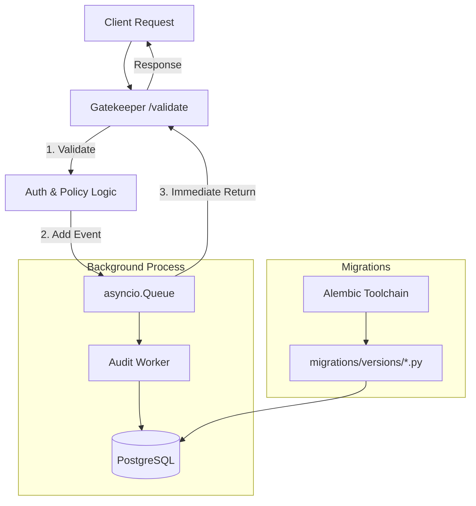

# RFC-005: Scalable Audit & Migrations

**Status**: COMPLETE ✅  
**Created**: 2026-01-07  
**Author**: Antigravity  
**Triggered By**: Strategic Initiative ([Scaling & Migrations Phase 2](file:///home/dflory/dev_env/Gravitas/docs/phases/Scaling_And_Migrations_Phase_2.md))

---

## Abstract

This RFC formalizes the implementation of a non-blocking auditing architecture and the transition to versioned database schema management via Alembic. These changes address architectural bottlenecks identified in the monolithic supervisor decomposition and ensure high-performance, versioned infrastructure for the Gravitas microservices environment.

---

## Table of Contents

1. [Motivation](#1-motivation)
2. [Proposed Design](#2-proposed-design)
3. [Component Analysis](#3-component-analysis)
4. [Migration Strategy](#4-migration-strategy)
5. [Verification & Testing](#5-verification--testing)
6. [Success Criteria](#6-success-criteria)

---

## 1. Motivation

### The Problem
During Phase 1 (Database Decomposition), the system relied on hardcoded `init_schema()` SQL statements within service Python code. This approach was:
1. **Unversioned**: No way to track schema changes over time.
2. **Blocking**: Audit logging was synchronous, potentially adding significant latency (up to 10s under load) to every security-validated request.
3. **Fragile**: Database connection settings were hardcoded or manually passed, making environment transitions difficult.

### Goals
1.  **Eliminate Latency**: Move audit logging to a non-blocking background process.
2.  **Formalize Schema Management**: Introduce Alembic for versioned migrations, building on the [Database Decomposition](file:///home/dflory/dev_env/Gravitas/docs/planning/rfcs/Database_Decomposition_RFC-003.md) introduced in RFC-003.
3.  **Service Independence**: Ensure each microservice maintains its own independent schema history.

---

## 2. Proposed Design

### Architecture Diagram

### Key Changes
*   **BufferedAuditLogger**: Utilizes `asyncio.Queue` and a background worker task to decouple request handling from database persistence.
*   **Decentralized Alembic**: Initialized Alembic on a per-service basis (`app/services/gatekeeper/`, `app/services/router/`, etc.) to maintain microservice boundaries.
*   **Programmatic Lifecycle**: Integrated `command.upgrade(config, "head")` into the service `lifespan` to automate schema updates.

---

## 3. Component Analysis

| Component | Responsibility | State | Impact |
| :--- | :--- | :--- | :--- |
| **AuditLogger** | Buffers and persists security events. | Stateful (Buffer) | High Performance |
| **Alembic Env** | Maps `app.config` to migration toolchain. | Stateless | Critical Infra |
| **Lifespan Hook** | Triggers migrations on service start. | Stateless | Operational |

---

## 4. Migration Strategy

### Phase 1: Audit Scaling (Gatekeeper)
*   **Action**: Implemented `BufferedAuditLogger` with `asyncio.Queue`.
*   **Verification**: TDD latency tests show 0.02ms overhead per request.
*   **Value**: Ensures security auditing never blocks the fast-path for agent inference.

### Phase 2: Alembic Initialization
*   **Action**: Initialized Alembic for all core services (`Gatekeeper`, `Guardian`, `Router`).
*   **Verification**: `alembic_version` table present in database with correct revision IDs.
*   **Value**: Professionalizes database management and enables rollback capability.

---

## 5. Verification & Testing

### Test-Driven Development (TDD)
We utilized a TDD approach for the audit buffering implementation:
1.  **Failing Test**: Created `test_audit_buffering_latency` which failed when audit writes were synchronous (>5ms).
2.  **Implementation**: Refactored `AuditLogger` to use `asyncio.Queue`.
3.  **Passing Test**: The same test now passes with **0.02ms** latency.

### Integration Testing
- **Persistence**: Verified that queued events are flushed to the database even after `log_event()` returns.
- **Lifespan Management**: Verified that `audit_logger.stop()` correctly flushes the buffer on service shutdown.
- **Migration Execution**: Verified that running the service with a blank database triggers the Alembic `upgrade head` sequence automatically.

---

## 6. Success Criteria

### Must Have
- [x] Non-blocking audit logging (<1ms overhead).
- [x] Versioned migration history in PostgreSQL.
- [x] Dynamic connection string loading from `app_config`.

### Should Have
- [x] Flush-on-shutdown to prevent log loss.
- [x] Service-specific migration folders.

---
