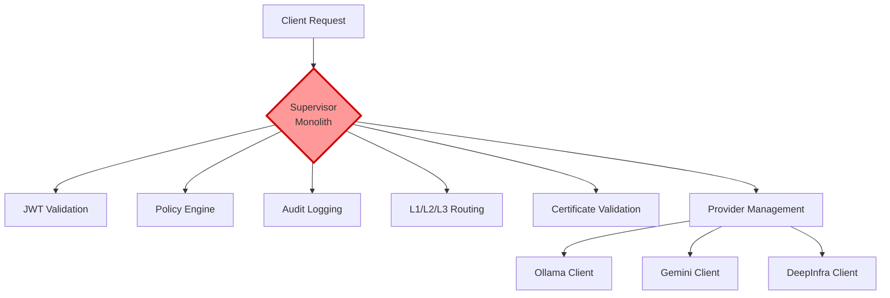
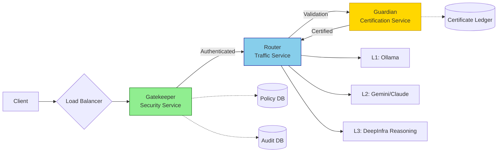

# RFC-001: Supervisor Service Decomposition

**Status**: DRAFT  
**Created**: 2026-01-07  
**Author**: Gravitas Architecture Team  
**Triggered By**: Critical Supervisor Failure (INC-2026-001)

---

## Abstract

This RFC proposes decomposing the monolithic Gravitas Supervisor service into three specialized microservices: **The Gatekeeper** (Security), **The Router** (Traffic Management), and **The Guardian** (Certification). This architectural evolution aims to improve system resilience, development velocity, and operational stability by eliminating the single point of failure that the current Supervisor represents.

---

## Table of Contents

1. [Motivation](#motivation)
2. [Current Architecture Analysis](#current-architecture-analysis)
3. [Proposed Architecture](#proposed-architecture)
4. [Detailed Component Design](#detailed-component-design)
5. [Migration Strategy](#migration-strategy)
6. [Performance & Scalability Analysis](#performance--scalability-analysis)
7. [Risk Assessment](#risk-assessment)
8. [Success Criteria](#success-criteria)
9. [Alternatives Considered](#alternatives-considered)
10. [Open Questions](#open-questions)

---

## 1. Motivation

### The Problem: Supervisor as a Single Point of Failure

The recent critical incident (INC-2026-001) exposed a fundamental architectural risk: when the Supervisor process crashes due to **any** failure (dependency error, uncaught exception, resource exhaustion), the entire Gravitas system becomes inoperable.

**Current Failure Blast Radius**:
- ❌ L1/L2/L3 Routing stops
- ❌ Policy Enforcement disabled
- ❌ Audit Logging halted
- ❌ JWT Generation/Validation unavailable
- ❌ Agent Certification blocked
- ❌ Provider Management (Ollama, Gemini, DeepInfra) inaccessible

This violates the **Single Responsibility Principle** and creates an operational nightmare where unrelated failures cascade across the entire system.

### Goals of This RFC

1. **Improve System Resilience**: Isolate failures to specific components
2. **Increase Development Velocity**: Enable independent deployment and testing of components
3. **Enhance Scalability**: Allow horizontal scaling of high-throughput components (Router) independently from stateful components (Guardian)
4. **Simplify Debugging**: Reduce cognitive load by separating concerns
5. **Enable Future Evolution**: Create clean boundaries for adding new capabilities (e.g., rate limiting, caching)

---

## 2. Current Architecture Analysis

### Supervisor Responsibilities (Current)



### Responsibility Matrix

| Responsibility | Purpose | State Required | Throughput | Failure Impact |
|----------------|---------|----------------|------------|----------------|
| **JWT Validation** | Authenticate requests | ❌ Stateless | High | Auth fails system-wide |
| **Policy Enforcement** | Authorize resource access | ✅ Policy DB | High | All requests allowed (security risk) |
| **Audit Logging** | Track all actions | ✅ Audit DB | High | Compliance violations |
| **L1/L2/L3 Routing** | Dispatch to correct tier | ❌ Stateless | Very High | No routing possible |
| **Certificate Validation** | Verify agent credentials | ✅ Certificate Ledger | Medium | Uncertified agents blocked |
| **Provider Management** | Execute model calls | ❌ Stateless | High | All inference blocked |

### Problem Indicators

1. **Cognitive Overload**: 6 distinct responsibilities in a single service
2. **Unrelated Failures**: A Gemini SDK import error (`google.generativeai`) broke JWT authentication
3. **Deployment Risk**: Any change to routing logic requires redeploying security enforcement
4. **Scaling Constraints**: Cannot scale routing independently from certificate management
5. **Testing Complexity**: Integration tests must mock all 6 subsystems simultaneously

---

## 3. Proposed Architecture

### Service Decomposition



### Service Responsibilities

| Service | Responsibilities | State | Scaling Profile |
|---------|-----------------|-------|-----------------|
| **Gatekeeper** | JWT validation, Policy enforcement, Audit logging | Policy DB, Audit DB | Horizontal (stateless auth + DB) |
| **Router** | L1/L2/L3 decision logic, Provider dispatch | Stateless | Horizontal (pure routing) |
| **Guardian** | Certificate validation, Ledger management | Certificate Ledger | Vertical (state-heavy) |

---

## 4. Detailed Component Design

### 4.1 The Gatekeeper (Security Helper)

**Purpose**: Handle all security-related concerns before routing decisions are made.

**API Endpoints**:
```
POST /gatekeeper/validate
  - Input: Authorization header, Request metadata
  - Output: JWT claims + Policy decision (ALLOW/DENY) + Audit ID
  - HTTP Codes: 200 (allowed), 401 (auth failed), 403 (policy denied)
```

**Components**:
1. **JWT Validator**: Stateless token verification
2. **Policy Engine**: Loads policies from `access_policies.yaml` + Ghost Registry
3. **Audit Logger**: Writes to audit database asynchronously

**Dependencies**:
- PostgreSQL (policy storage, audit logs)
- Redis (optional: policy cache)

**Failure Isolation**:
- If Gatekeeper fails → Return 503, Router + Guardian still healthy
- Audit logging failures don't block requests (async writes with retry)

**Example Flow**:
```python
# Gatekeeper validates and returns enriched context
@app.post("/gatekeeper/validate")
async def validate_request(auth: str, metadata: dict):
    claims = validate_jwt(auth)  # Raises 401 if invalid
    
    decision = policy_engine.check(
        ghost_id=claims["sub"],
        groups=claims["groups"],
        resource=metadata["model"],
        action="inference"
    )
    
    if decision.denied:
        raise HTTPException(403, decision.reason)
    
    audit_id = await audit_logger.log(claims, metadata, decision)
    
    return {
        "allowed": True,
        "ghost_id": claims["sub"],
        "groups": claims["groups"],
        "audit_id": audit_id
    }
```

---

### 4.2 The Router (Traffic Helper)

**Purpose**: Make routing decisions (L1/L2/L3) and dispatch to the correct provider.

**API Endpoints**:
```
POST /v1/chat/completions
  - Input: OpenAI-compatible request + Gatekeeper context
  - Output: Model response or routing decision
  - HTTP Codes: 200 (success), 400 (bad request), 500 (provider error)
```

**Components**:
1. **Routing Logic**: Determines L1/L2/L3 based on model name
2. **Provider Clients**: Ollama, Gemini, Claude, DeepInfra wrappers
3. **Request Formatter**: Converts to provider-specific formats

**Dependencies**:
- External Provider APIs (Ollama, Gemini, etc.)
- Guardian service (certificate validation)

**Failure Isolation**:
- If Gemini SDK fails → Only L2 Gemini routes fail, L1/L3 unaffected
- Router stateless → Easy horizontal scaling
- Provider failures isolated (Ollama down ≠ Gemini down)

**Example Flow**:
```python
@app.post("/v1/chat/completions")
async def route_request(request: ChatRequest, gatekeeper_ctx: dict):
    # Determine tier from model name
    tier = determine_tier(request.model)  # L1/L2/L3
    
    # Guardian validates certificate
    cert_status = await guardian_client.validate_certificate(
        ghost_id=gatekeeper_ctx["ghost_id"],
        model=request.model
    )
    
    if not cert_status.valid:
        raise HTTPException(403, f"Certificate invalid: {cert_status.reason}")
    
    # Dispatch to provider
    provider = get_provider(tier, request.model)
    response = await provider.execute(request)
    
    return response
```

---

### 4.3 The Guardian (Certification Helper)

**Purpose**: Manage agent certificates and the certification ledger.

**API Endpoints**:
```
GET /guardian/validate/{ghost_id}/{model}
  - Input: Ghost ID, Model name
  - Output: Certificate validation result
  - HTTP Codes: 200 (valid), 403 (invalid/expired), 404 (no cert)

POST /guardian/certify
  - Input: Ghost ID, Model name, Certification metadata
  - Output: Certificate ID
  - HTTP Codes: 201 (created), 400 (invalid request)
```

**Components**:
1. **Certificate Validator**: Checks ledger for valid, non-expired certificates
2. **Ledger Manager**: CRUD operations on certificate database
3. **Badge System**: Maps Ghost IDs to agent badges (existing Phase 7 feature)

**Dependencies**:
- PostgreSQL (certificate ledger, badge registry)

**Failure Isolation**:
- If Guardian fails → Cached certificates still usable (grace period)
- Certificate validation can be made eventually consistent
- Badge updates don't affect routing

**Example Flow**:
```python
@app.get("/guardian/validate/{ghost_id}/{model}")
async def validate_certificate(ghost_id: str, model: str):
    # Check ledger for valid certificate
    cert = await ledger.get_certificate(ghost_id, model)
    
    if not cert:
        return {"valid": False, "reason": "No certificate found"}
    
    if cert.expired():
        return {"valid": False, "reason": "Certificate expired"}
    
    return {
        "valid": True,
        "certificate_id": cert.id,
        "expires_at": cert.expires_at
    }
```

---

## 5. Migration Strategy

### Phase 1: Extract Guardian (Low Risk)

**Why First?**
- Certificate validation is least coupled to request path
- Can run in parallel with existing Supervisor
- Lowest throughput requirement

**Steps**:
1. Create `gravitas_guardian` service from existing `SupervisorGuardian` code
2. Update Supervisor to call Guardian service (with fallback to local validation)
3. Monitor Guardian performance and error rates
4. Deprecate local Guardian code in Supervisor

**Verification**:
- All Phase 5 integration tests still pass
- Guardian service responds within 50ms p99
- No certificate validation errors

**Rollback**: Disable Guardian service, Supervisor uses local validation

---

### Phase 2: Extract Gatekeeper (Medium Risk)

**Why Second?**
- Security is critical but well-tested in Phase 7
- Policy engine is stateless (easy to replicate)
- Audit logging can be async (fault-tolerant)

**Steps**:
1. Create `gravitas_gatekeeper` service from existing auth/policy code
2. Add middleware to Supervisor that calls Gatekeeper (with circuit breaker)
3. Migrate audit logging to Gatekeeper (dual-write pattern)
4. Monitor auth/policy decision latency
5. Remove auth code from Supervisor

**Verification**:
- All Phase 7 security tests still pass
- Gatekeeper latency < 20ms p99
- Audit logs complete and accurate

**Rollback**: Circuit breaker falls back to Supervisor auth

---

### Phase 3: Extract Router (High Risk)

**Why Last?**
- Router is highest throughput component
- Provider clients are complex (Gemini, Ollama, etc.)
- Routing logic is core business logic

**Steps**:
1. Create `gravitas_router` service (stateless routing + provider clients)
2. Set up reverse proxy: Gatekeeper → Router → Providers
3. Load test with production traffic replay
4. Gradual traffic shift (10% → 50% → 100%)
5. Decommission Supervisor service

**Verification**:
- All integration tests pass (Phase 5, Phase 7)
- Latency unchanged (p50, p95, p99)
- Error rate unchanged
- Cost/throughput acceptable

**Rollback**: Redirect traffic back to Supervisor

---

### Phase 4: Decommission Supervisor

**Final Steps**:
1. Confirm no traffic to Supervisor for 7 days
2. Archive Supervisor code to `legacy/supervisor`
3. Update documentation to reflect new architecture
4. Close INC-2026-001 with architectural resolution

---

## 6. Performance & Scalability Analysis

### Latency Analysis

| Architecture | Auth | Policy | Cert Check | Routing | Total |
|--------------|------|--------|------------|---------|-------|
| **Current (Monolith)** | 5ms | 10ms | 15ms | 20ms | **50ms** |
| **Proposed (Microservices)** | 5ms + 3ms<br/>(network) | 10ms + 3ms<br/>(network) | 15ms + 3ms<br/>(network) | 20ms | **59ms** |

**Network Overhead**: +9ms (~18% increase) due to 3 inter-service calls

**Mitigation Strategies**:
1. **gRPC**: Use gRPC instead of HTTP for inter-service calls (reduce to +3ms total)
2. **Connection Pooling**: Reuse TCP connections (reduce handshake overhead)
3. **Result Caching**: Cache Gatekeeper decisions for repeated requests (bypass re-validation)
4. **Service Mesh**: Use Istio/Linkerd for optimized service-to-service communication

**Optimistic Target**: 52ms total latency (4% overhead) with gRPC + connection pooling

---

### Scalability Improvements

| Component | Current Scaling | Proposed Scaling | Benefit |
|-----------|-----------------|------------------|---------|
| **Router** | Tied to Supervisor (1:1) | Independent horizontal | 10x throughput with 10 Router instances |
| **Gatekeeper** | Tied to Supervisor (1:1) | Independent horizontal | Burst traffic handling |
| **Guardian** | Tied to Supervisor (1:1) | Vertical + Read Replicas | Certificate lookups scale independently |

**Cost Savings**:
- Current: Must scale entire Supervisor (heavy) for routing load
- Proposed: Scale only Router (lightweight) for routing load

**Example**: Handling 1000 req/s
- Current: 10 Supervisor instances × 2GB RAM = 20GB total
- Proposed: 10 Router instances × 512MB RAM + 2 Gatekeeper × 1GB + 1 Guardian × 2GB = **9GB total** (55% reduction)

---

## 7. Risk Assessment

### High Risks

| Risk | Probability | Impact | Mitigation |
|------|-------------|--------|------------|
| **Network Latency** | Medium | Medium | Use gRPC, connection pooling, caching |
| **Cascading Failures** | Low | High | Circuit breakers, timeouts, graceful degradation |
| **Data Consistency** | Low | High | Use distributed tracing, strict API contracts |
| **Migration Complexity** | High | High | Phased rollout, extensive testing, feature flags |

### Low Risks

| Risk | Probability | Impact | Mitigation |
|------|-------------|--------|------------|
| **Increased Ops Complexity** | Medium | Low | Docker Compose already used, add 2 more services |
| **Debugging Difficulty** | Low | Medium | Use distributed tracing (OpenTelemetry) |

---

## 8. Success Criteria

### Must Have (MVP)

- [ ] All existing integration tests pass (Phase 5, Phase 7)
- [ ] Latency increase < 20% (50ms → 60ms max)
- [ ] Zero data loss (audit logs, certificates)
- [ ] Graceful failure handling (one service down ≠ system down)

### Should Have (Production Ready)

- [ ] Latency increase < 10% (50ms → 55ms)
- [ ] Horizontal scaling validated (10x throughput with 10 Router instances)
- [ ] Observability: Metrics, logs, traces across all services
- [ ] Circuit breakers implemented for all inter-service calls

### Nice to Have (Future Optimization)

- [ ] Latency parity with monolith (50ms with gRPC)
- [ ] Auto-scaling policies for Router service
- [ ] Guardian certificate caching (Redis) for read-heavy workloads

---

## 9. Alternatives Considered

### Alternative 1: Keep Monolith, Add Process Monitoring

**Approach**: Use supervisord or systemd to auto-restart Supervisor on failure

**Pros**:
- Zero development cost
- No architectural changes

**Cons**:
- Doesn't prevent failures, just restarts faster
- Still loses in-flight requests
- Doesn't improve scalability
- Restart time ~5-10 seconds (still unacceptable)

**Verdict**: ❌ Rejected - Band-aid solution, doesn't address root cause

---

### Alternative 2: Module Isolation Within Monolith

**Approach**: Separate code into modules but keep single deployment unit

**Pros**:
- No network overhead
- Easier to refactor first

**Cons**:
- Still single point of failure
- Cannot scale components independently
- Doesn't isolate dependency failures (e.g., Gemini SDK still breaks auth)

**Verdict**: ❌ Rejected - Doesn't solve the core problem

---

### Alternative 3: Event-Driven Architecture (Message Queue)

**Approach**: Use RabbitMQ/Kafka for async request handling

**Pros**:
- Decouples services completely
- Excellent for async workflows

**Cons**:
- Adds significant latency (queuing overhead)
- Overkill for synchronous request/response pattern
- Complexity of event schema management

**Verdict**: ❌ Rejected - Wrong pattern for synchronous inference requests

---

### Alternative 4: Serverless Functions (AWS Lambda, Cloud Run)

**Approach**: Deploy each component as a serverless function

**Pros**:
- Automatic scaling
- Pay-per-use pricing

**Cons**:
- Cold start latency (100ms+)
- Vendor lock-in
- Cost unpredictability at scale
- Not suitable for on-prem deployment

**Verdict**: ❌ Rejected - Gravitas needs on-prem support

---

## 10. Open Questions

### For Immediate Discussion

1. **gRPC vs HTTP/JSON**: Should we use gRPC for inter-service communication or stick with HTTP?
   - **Recommendation**: Start with HTTP (faster to implement), migrate to gRPC in Phase 4

2. **Service Discovery**: Do we need Consul/etcd or is Docker DNS sufficient?
   - **Recommendation**: Docker DNS sufficient for MVP (<10 services)

3. **Database Sharing**: Should Gatekeeper and Guardian share the same PostgreSQL instance?
   - **Recommendation**: Yes for MVP, separate in production for isolation

4. **Circuit Breaker Library**: Use Hystrix, Resilience4j, or build custom?
   - **Recommendation**: Use `aiobreaker` (Python async circuit breaker library)

### For Future Consideration

5. **API Gateway**: Should we introduce Kong/Nginx as a unified entry point?
   - **Defer**: Add in Phase 5 if load balancing required

6. **Rate Limiting**: Where should rate limiting live? Gatekeeper or API Gateway?
   - **Defer**: Add to Gatekeeper in future iteration

7. **Multi-Tenancy**: How does this architecture support multiple tenants?
   - **Defer**: Out of scope for RFC-001

---

## Conclusion

The decomposition of the Supervisor into Gatekeeper, Router, and Guardian services addresses the critical single point of failure identified in INC-2026-001 while paving the way for improved scalability and development velocity.

**Recommendation**: **APPROVE** with phased rollout starting with Guardian extraction.

**Next Steps**:
1. Gather feedback from stakeholders on this RFC
2. Create implementation plan for Phase 1 (Guardian extraction)
3. Set up observability infrastructure (OpenTelemetry, Prometheus)
4. Begin Guardian service scaffolding

---

## Appendix A: Glossary

- **L1/L2/L3**: Routing tiers (L1=Lightweight/Ollama, L2=Production/Gemini, L3=Reasoning/DeepInfra)
- **Ghost**: User identity in Gravitas system
- **Shell**: Agent execution engine
- **Badge**: Agent capabilities and permissions
- **Ledger**: Certificate audit trail

---

## Appendix B: Related Documents

- [Critical Supervisor Failure Report](file:///home/dflory/dev_env/Gravitas/docs/criticalSupervisorFailureReport.md)
- [Incident Log INC-2026-001](file:///home/dflory/dev_env/Gravitas/docs/INCIDENT_LOG.md)
- [Phase 7 TODO](file:///home/dflory/dev_env/Gravitas/docs/TODO7.md)
- [Model Governance](file:///home/dflory/dev_env/Gravitas/docs/007_model_governance.md)
- [Development Protocols](file:///home/dflory/dev_env/Gravitas/docs/005_development_protocols.md)

---

**RFC Status**: DRAFT  
**Requires Approval From**: Architecture Lead, DevOps Lead, Security Lead  
**Target Decision Date**: 2026-01-14  
**Target Implementation Start**: 2026-01-21
