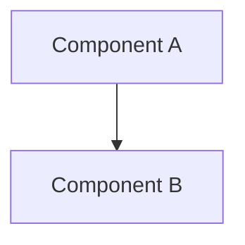

# RFC-000: [Title]

**Status**: DRAFT / REVIEW / COMPLETE  
**Created**: YYYY-MM-DD  
**Author**: [Name/Role]  
**Triggered By**: [Incident ID or "Strategic Initiative"]

---

## Abstract

[A short, high-level summary of the proposal. 2-3 sentences max.]

---

## Table of Contents

1. [Motivation](#motivation)
2. [Proposed Design](#proposed-design)
3. [Component Analysis](#component-analysis)
4. [Migration Strategy](#migration-strategy)
5. [Risk Assessment](#risk-assessment)
6. [Success Criteria](#success-criteria)
7. [Alternatives Considered](#alternatives-considered)

---

## 1. Motivation

### The Problem
[Describe the current state and why it is insufficient. Use specific examples or incident references.]

### Goals
1.  **[Goal 1]**: [Description]
2.  **[Goal 2]**: [Description]

---

## 2. Proposed Design

### Architecture Diagram

### Key Changes
*   **[Change 1]**: Description
*   **[Change 2]**: Description

---

## 3. Component Analysis

| Component | Responsibility | State | Impact |
| :--- | :--- | :--- | :--- |
| **[Name]** | [What does it do?] | [Stateless/Stateful] | [Low/High] |

---

## 4. Migration Strategy

### Phase 1: [Step Name]
*   **Action**: [What to do]
*   **Verification**: [How to prove it works]
*   **Rollback**: [How to undo it]

### Phase 2: [Step Name]
...

---

## 5. Risk Assessment

| Risk | Probability | Impact | Mitigation |
| :--- | :--- | :--- | :--- |
| **[Risk Name]** | [Low/Med/High] | [Low/Med/High] | [Strategy] |

---

## 6. Success Criteria

### Must Have
- [ ] [Criteria 1]
- [ ] [Criteria 2]

### Should Have
- [ ] [Criteria 3]

---

## 7. Alternatives Considered

### Alternative 1: [Title]
*   **Pros**: ...
*   **Cons**: ...
*   **Verdict**: Rejected because...
